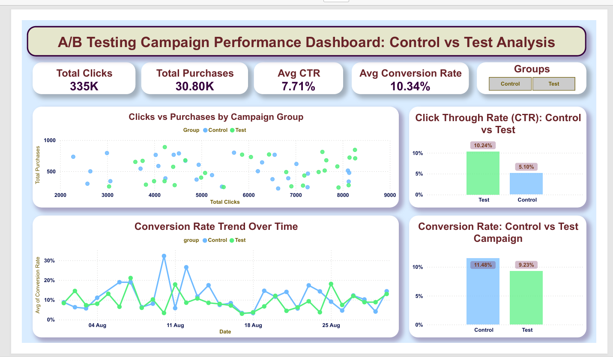

# A/B Testing Campaign Performance Analysis

## 📊 Project Overview

This project performs a comprehensive statistical analysis of marketing campaign performance by comparing two campaigns:
- **Control Campaign**: Baseline campaign performance
- **Test Campaign**: New campaign variant performance

Using rigorous statistical A/B testing methodology, this analysis determines which campaign performs better and provides data-driven business recommendations.

---

## 🎯 Problem Statement

When running marketing campaigns, it's critical to understand which campaign variant performs better. This project addresses:

- **Does the Test campaign have a better Click-Through Rate (CTR) than the Control?**
- **Does conversion quality differ between campaigns?**
- **What is the cost efficiency of each campaign?**
- **Which campaign should we scale?**

---

## 📁 Project Structure

```
AB Testing for Marketing Campaign Optimization/
│
├── README.md                      # Project documentation (this file)
├── AB_Testing_Analysis.ipynb      # Main analysis notebook
├── control_group.csv              # Control campaign data
├── test_group.csv                 # Test campaign data
├── AB testing Dashboard           # Power BI dasbboard
│
└── processed/
    └── final_ab_data.csv          # Combined and processed data (optional)
```

---

## 📋 Datasets

### **control_group.csv**
Control campaign daily performance data including:
- Campaign Name
- Date
- Spend (USD)
- Impressions
- Reach
- Website Clicks
- Searches
- View Content
- Add to Cart
- Purchases

### **test_group.csv**
Test campaign daily performance data with the same structure as control group.

**Data Format**: Semicolon-delimited CSV files

---

## 📊 Key Metrics Analyzed

### Primary Metrics
1. **CTR (Click-Through Rate)** = Clicks / Impressions
   - Measure of ad attractiveness and relevance
   - Higher is better

2. **Conversion Rate** = Conversions / Clicks
   - Measure of landing page and funnel quality
   - Higher is better

3. **CPA (Cost Per Acquisition)** = Spend / Conversions
   - Measure of campaign efficiency
   - Lower is better

### Secondary Metrics
- Total Spend
- Total Impressions
- Total Clicks
- Total Conversions

---

## 🔬 Statistical Methodology

### Tests Performed

#### 1. **Proportion Z-Test for CTR**
- **Hypothesis**: Test if CTR differs significantly between campaigns
- **Null Hypothesis (H₀)**: CTR_Control = CTR_Test
- **Alternative Hypothesis (H₁)**: CTR_Control ≠ CTR_Test

#### 2. **Proportion Z-Test for Conversion Rate**
- **Hypothesis**: Test if conversion rates differ significantly
- **Null Hypothesis (H₀)**: Conv_Rate_Control = Conv_Rate_Test
- **Alternative Hypothesis (H₁)**: Conv_Rate_Control ≠ Conv_Rate_Test

#### 3. **Independent Samples T-Test for CPA**
- **Hypothesis**: Test if average CPA differs significantly
- **Null Hypothesis (H₀)**: CPA_Control = CPA_Test
- **Alternative Hypothesis (H₁)**: CPA_Control ≠ CPA_Test

### Statistical Parameters
- **Significance Level (α)**: 0.05 (95% confidence level)
- **Test Type**: Two-tailed tests
- **Decision Rule**: Reject H₀ if p-value < 0.05

---

## 📈 Analysis Results

### Key Findings

| Metric | Control | Test | Significant? | Winner |
|--------|---------|------|--------------|--------|
| CTR | 4.86% | 8.09% | ✅ YES | Test |
| Conversion Rate | 9.83% | 8.64% | ✅ YES | Control |
| CPA | $5.05 | $5.90 | ❌ NO | — |

### Interpretation

1. **CTR Analysis**: 
   - Test campaign has **significantly HIGHER CTR** (8.09% vs 4.86%, p < 0.001)
   - Test gets more clicks per impression (better awareness/reach)

2. **Conversion Rate Analysis**:
   - Control campaign has **significantly HIGHER conversion rate** (9.83% vs 8.64%, p < 0.001)
   - Control converts visitors to customers more effectively

3. **CPA Analysis**:
   - **No significant difference** in CPA (p = 0.196)
   - Both campaigns have similar cost efficiency per conversion

---

## 💡 Business Recommendations

### Scenario Analysis

**Mixed Performance Results**: The campaigns excel in different areas:

| Campaign | Strengths | Use Case |
|----------|-----------|----------|
| **Test** | Higher CTR (more clicks) | Good for brand awareness, reach, top-of-funnel |
| **Control** | Better conversion (quality) | Good for revenue, efficiency, bottom-of-funnel |

### Recommended Actions

1. **Align with Business Goals**:
   - If goal is **user acquisition**: Scale the **Test campaign** (higher reach)
   - If goal is **revenue/profit**: Use **Control campaign** (better converters)
   - If goal is **balanced**: Run both with budget allocation based on priorities

2. **Next Steps**:
   - Present findings to marketing/business stakeholders
   - Perform follow-up A/B tests on campaign variants
   - Segment data by user demographics for deeper insights
   - Test other variables (creative, messaging, timing, audience)
   - Monitor real-world performance post-implementation

3. **Data Monitoring**:
   - Track metrics daily for sustained performance
   - Set up alerts for unusual variations
   - Perform quarterly re-testing to validate findings

---

## 📊 Visualizations Generated

The notebook creates the following visualizations:

1. **Campaign Performance Comparison** (6-subplot figure):
   - Average CTR comparison
   - Average Conversion Rate comparison
   - Average CPA comparison
   - Total Spend comparison
   - Total Conversions comparison
   - Total Impressions comparison

2. **Statistical Test Results** (P-Values visualization):
   - CTR test p-value
   - Conversion Rate test p-value
   - CPA test p-value
   - Significance threshold indicator

---

## 📚 Technical Details

### Statistical Tests Used

**Proportion Z-Test**:
- Used for CTR and Conversion Rate comparisons
- Formula: Z = (p₁ - p₂) / √[p(1-p)(1/n₁ + 1/n₂)]
- Where: p₁, p₂ are proportions; p is pooled proportion

**Independent Samples T-Test**:
- Used for CPA comparison
- Tests if means of two independent groups differ
- Formula: t = (x̄₁ - x̄₂) / √[s²(1/n₁ + 1/n₂)]

### Software & Libraries

| Library | Version | Purpose |
|---------|---------|---------|
| pandas | 3.0.1 | Data manipulation |
| numpy | 2.4.3 | Numerical computations |
| matplotlib | 3.10.8 | Visualization |
| seaborn | 0.13.2 | Statistical visualization |
| scipy | 1.17.1 | Statistical tests |

---
## 📊 Power BI Dashboard

An interactive Power BI dashboard is created to visually compare the performance of Control and Test campaigns.

### Dashboard Highlights:

* KPI Cards:

  * Total Clicks
  * Total Purchases
  * Average CTR
  * Average Conversion Rate
* Campaign Comparison:

  * CTR (Control vs Test)
  * Conversion Rate (Control vs Test)
* Trend Analysis:

  * Conversion Rate over time
* Scatter Plot:

  * Clicks vs Purchases relationship

### Key Insight from Dashboard:

* The **Test campaign** shows higher CTR (better engagement)
* The **Control campaign** shows higher conversion rate (better efficiency)

👉 The dashboard visually confirms the statistical analysis results.

<p align="center">
  
</p>
---

## 🎓 Learning Outcomes

By working through this project, you'll understand:

✅ A/B testing fundamentals and best practices  
✅ Statistical hypothesis testing methodology  
✅ Proportion tests (Z-tests) for categorical data  
✅ T-tests for continuous data comparison  
✅ P-values and statistical significance  
✅ Business interpretation of statistical results  
✅ Data visualization for storytelling  
✅ End-to-end data analysis workflow  

---

## 📞 FAQ

**Q: What does p-value < 0.05 mean?**
A: There's less than 5% probability the observed difference is due to random chance. We conclude the difference is statistically significant.

**Q: Why do we use different tests?**
A: CTR and Conversion Rate are proportions (binary outcomes), so we use Z-tests. CPA is continuous, so we use T-tests.

**Q: Can we guarantee Test is better than Control?**
A: No. Statistical significance means the difference is real, but "better" depends on your business goals (CTR advantage vs conversion quality).

**Q: What sample size do we need?**
A: Larger samples increase statistical power. Our analysis shows strong results with ~30 days of data per campaign.

**Q: How long should we run the test?**
A: Minimum 1-2 weeks per campaign to account for daily variations. Longer periods provide more robust results.

---

## 📝 Version History

| Version | Date | Changes |
|---------|------|---------|
| 1.0 | 2026-03-27 | Initial A/B testing analysis with 3 statistical tests |

---

## 🤝 Contributing

To improve this analysis:
1. Add segmentation analysis (by user demographics)
2. Implement time-series visualizations
3. Add confidence interval calculations
4. Create automated reporting pipeline
5. Add effect size calculations (Cohen's d)

---

---

## 🎯 Summary

This comprehensive A/B testing analysis provides:
- **Data**: 60 days of campaign performance data
- **Analysis**: Rigorous statistical testing with 95% confidence level
- **Insights**: Clear performance comparison and significance determination
- **Recommendations**: Actionable business decisions backed by data

**Result**: Statistically significant differences detected in CTR and Conversion Rate, enabling data-driven decisions about campaign scaling and optimization.

---

**Last Updated**: March 27, 2026  
**Analysis Confidence**: 95% (α = 0.05)  
**Status**: Production Ready ✅
